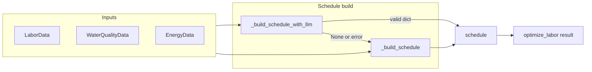

# LLM-based labor schedule method

## Goal

Add a new method that uses the LLM to produce the structured labor schedule (morning/afternoon/evening shifts with tasks and worker counts), and use it in `optimize_labor()` with a safe fallback to the current rule-based logic.

## Contract the schedule must satisfy

The UI and API expect a schedule dict with optional keys:

- `morning_shift` / `afternoon_shift` / `evening_shift`
- Each shift: `time` (str, e.g. `"06:00"`), `tasks` (list of strings), `workers` (int >= 0)

Defined in [shrimp-farm-ai-assistant/agents/labor_optimization_agent.py](shrimp-farm-ai-assistant/agents/labor_optimization_agent.py) (lines 307–325) and consumed by [shrimp-farm-ai-assistant/web/src/components/OptimizationView.tsx](shrimp-farm-ai-assistant/web/src/components/OptimizationView.tsx) (`primaryLaborOpt.schedule.morning_shift?.tasks`, `.workers`, etc.).

## Implementation approach

**1. New method: `_build_schedule_with_llm()`**

- **Location:** [shrimp-farm-ai-assistant/agents/labor_optimization_agent.py](shrimp-farm-ai-assistant/agents/labor_optimization_agent.py).
- **Signature:** Same as `_build_schedule(self, labor_data, water_quality_data, energy_data)`.
- **Behavior:**
  - If `self.llm` is None, return `None` (caller will fall back to rule-based).
  - Build a prompt that includes:
    - Labor: `worker_count`, `next_tasks` or `tasks_completed`, and optionally `efficiency_score` / `time_spent`.
    - Water: short summary (e.g. pH, temperature, dissolved_oxygen, status, number of alerts).
    - Energy: e.g. `efficiency_score`, total/cost if useful.
  - Ask the LLM to return **only** a single JSON object with this exact structure (no markdown, no extra text):

```json
    {
      "morning_shift": { "time": "06:00", "tasks": ["Task A", "Task B"], "workers": 1 },
      "afternoon_shift": { "time": "12:00", "tasks": ["Task C"], "workers": 1 },
      "evening_shift": { "time": "18:00", "tasks": ["Task D"], "workers": 0 }
    }
    

```

- Constraints to state in the prompt: total workers across shifts should not exceed `labor_data.worker_count`; task names should be concrete (e.g. from provided next_tasks or standard farm tasks like "Feed distribution", "Water quality testing"); shifts can be omitted if no workers/tasks.
- Invoke the LLM the same way as elsewhere in the project (e.g. `self.llm.invoke([HumanMessage(content=prompt)])` or the pattern used in [shrimp-farm-ai-assistant/agents/decision_recommendation_agent.py](shrimp-farm-ai-assistant/agents/decision_recommendation_agent.py) / [shrimp-farm-ai-assistant/models/xgboost_decision_agent.py](shrimp-farm-ai-assistant/models/xgboost_decision_agent.py)).
- Parse response: extract JSON from the raw string (e.g. regex for `\{[\s\S]*\}`, then `json.loads`), following the pattern in [shrimp-farm-ai-assistant/agents/feeding_optimizer.py](shrimp-farm-ai-assistant/agents/feeding_optimizer.py) (lines 166–170).
- Validate and normalize:
  - For each shift key present: ensure `time` is a string (default e.g. `"06:00"` / `"12:00"` / `"18:00"`), `tasks` is a list of strings (filter non-strings), `workers` is an int >= 0 (clamp to 0 and cap by remaining worker budget if desired).
  - Optionally cap total workers across shifts by `labor_data.worker_count` to avoid overscheduling.
- Return the normalized schedule dict; if parsing or validation fails, return `None`.

**2. Integrate into `optimize_labor()`**

- In [shrimp-farm-ai-assistant/agents/labor_optimization_agent.py](shrimp-farm-ai-assistant/agents/labor_optimization_agent.py), replace the direct call to `_build_schedule` for `result["schedule"]` with:
  - Try: `schedule = self._build_schedule_with_llm(labor_data, water_quality_data, energy_data)`.
  - If the result is `None` or invalid (e.g. not a dict or missing required structure), or on any exception: `schedule = self._build_schedule(labor_data, water_quality_data, energy_data)`.
  - Set `result["schedule"] = schedule`.
- No change to the return shape of `optimize_labor()`; the rest of the API and UI remain unchanged.

**3. Optional: config flag**

- If desired, add an env/config flag (e.g. `USE_LLM_SCHEDULE=true|false` in [shrimp-farm-ai-assistant/config.py](shrimp-farm-ai-assistant/config.py)) and in `optimize_labor()` only call `_build_schedule_with_llm` when the flag is true; otherwise use rule-based only. This keeps the plan small; can be added later.

## Data flow (high level)




## Files to touch

- **[shrimp-farm-ai-assistant/agents/labor_optimization_agent.py](shrimp-farm-ai-assistant/agents/labor_optimization_agent.py):** Add `_build_schedule_with_llm()` (prompt construction, LLM invoke, JSON extract, validate/normalize, return dict or None). Update `optimize_labor()` to try LLM schedule then fall back to `_build_schedule()`. Add `import re` and `import json` if not already present.

## Out of scope

- Adding a night shift to the schema (backend/UI) or changing the UI.
- Using CrewAI for this specific schedule call (one direct LLM call is sufficient and keeps parsing simple).
- Changing how labor data is fetched or generated.

