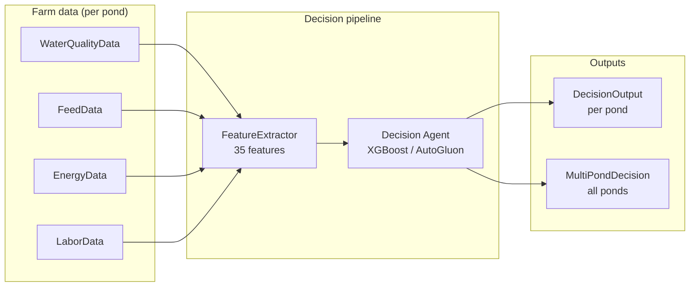
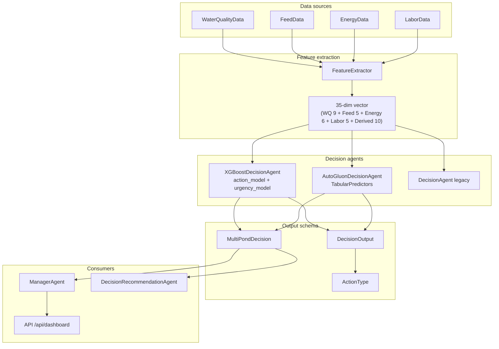
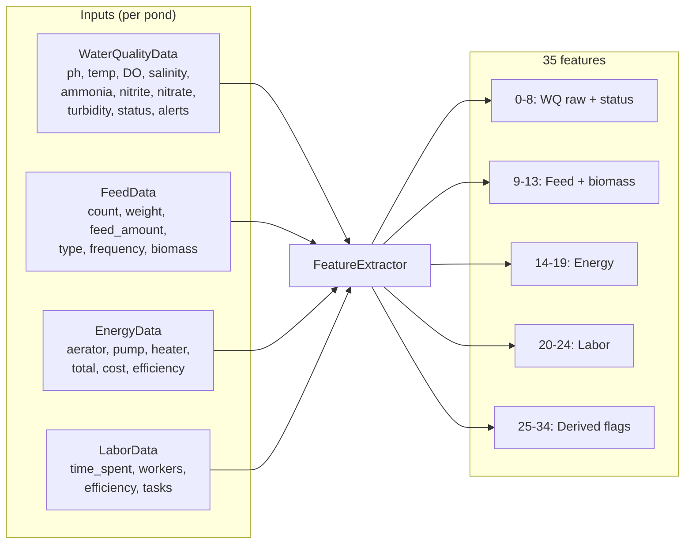
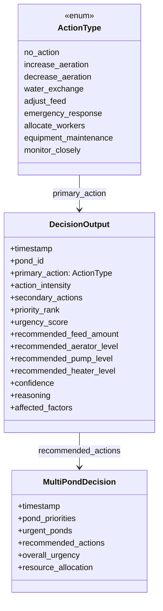
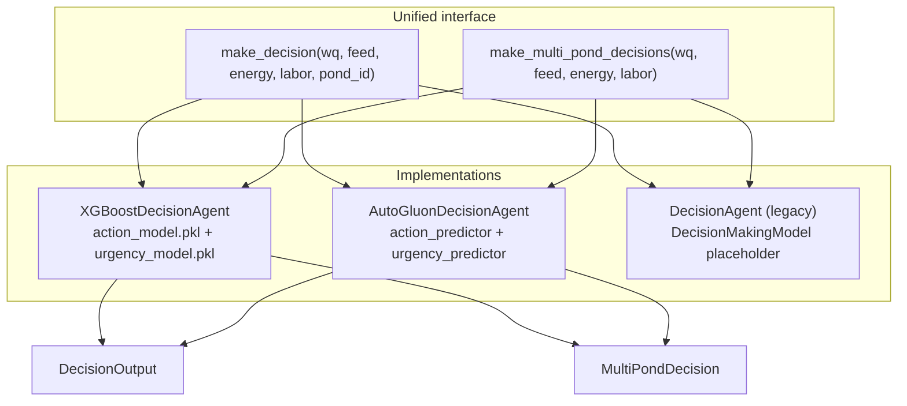
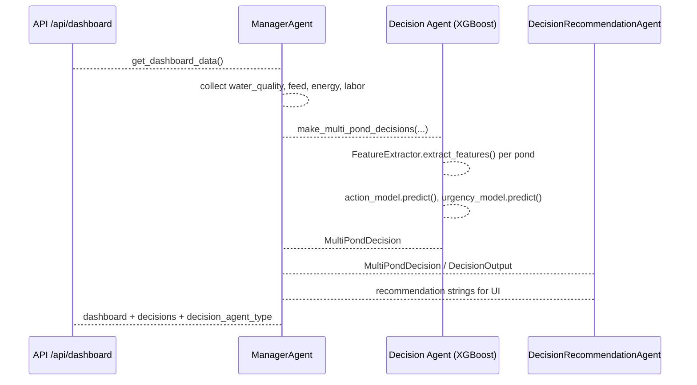

# Decision Model Architecture

This document describes the **decision model** used by the shrimp farm AI assistant: inputs (features), output schema, agent implementations, and how they are trained and used.

**Elaborate view (inputs, 35 features, agents, outputs, consumers):**

---

## 1. Overview

The decision system recommends **per-pond actions** (e.g. increase aeration, water exchange, adjust feed) and **urgency/priority** from current farm data (water quality, feed, energy, labor). All agents share the same **feature extractor** and **output models**.

### 1.1 High-level flow

### 1.2 End-to-end architecture

---

## 2. Input: Feature Extraction

**Module:** `models/decision_model.py` — `FeatureExtractor`

**Input:** For a single pond, one record each of:
- `WaterQualityData` (ph, temperature, dissolved_oxygen, salinity, ammonia, nitrite, nitrate, turbidity, status, alerts)
- `FeedData` (shrimp_count, average_weight, feed_amount, feed_type, feeding_frequency; biomass derived)
- `EnergyData` (aerator_usage, pump_usage, heater_usage, total_energy, cost, efficiency_score)
- `LaborData` (tasks_completed, time_spent, worker_count, efficiency_score, next_tasks)

**Output:** A single **35-dimensional float vector** per pond.

### 2.1 Feature extraction diagram

### 2.2 Feature Layout (35 features)

| Index | Group            | Features |
|-------|------------------|----------|
| 0–8   | Water quality    | ph, temperature, dissolved_oxygen, salinity, ammonia, nitrite, nitrate, turbidity, status_encoded (1–5) |
| 9–13  | Feed             | shrimp_count, average_weight, feed_amount, feeding_frequency, biomass (count×weight/1000) |
| 14–19 | Energy           | aerator_usage, pump_usage, heater_usage, total_energy, cost, efficiency_score |
| 20–24 | Labor            | time_spent, worker_count, efficiency_score, len(tasks_completed), len(next_tasks) |
| 25–34 | Derived          | low_DO_flag (<5), critical_DO_flag (<4), high_ammonia (>0.2), critical_ammonia (>0.3), low_temp (<26), high_temp (>30), pH_out_of_range, alert_count, energy_efficiency×wq_score, feed_per_biomass_ratio |

`FeatureExtractor.extract_features(water_quality_data, feed_data, energy_data, labor_data, pond_id=None)` returns this list of 35 floats for one pond (or the first pond if `pond_id` is omitted).

---

## 3. Output: Decision Models

**Module:** `models/decision_outputs.py`

### 3.0 Output model structure

### 3.1 ActionType (enum)

Recommended action for a pond:

| Value                  | Meaning               |
|------------------------|-----------------------|
| `no_action`            | No change             |
| `increase_aeration`    | Increase aeration     |
| `decrease_aeration`    | Decrease aeration     |
| `water_exchange`       | Partial water exchange|
| `adjust_feed`           | Adjust feed amount    |
| `emergency_response`   | Emergency response    |
| `allocate_workers`      | Reallocate labor      |
| `equipment_maintenance` | Schedule maintenance  |
| `monitor_closely`       | Monitor only          |

Agents typically map an integer index 0..7 (or 0..8) to these enum values.

### 3.2 DecisionOutput (per pond)

Pydantic model; one per pond.

| Field                       | Type           | Description |
|----------------------------|----------------|-------------|
| timestamp                  | datetime       | Decision time |
| pond_id                    | int            | Pond ID |
| primary_action             | ActionType     | Main recommended action |
| action_intensity           | float          | 0–1 |
| secondary_actions           | List[ActionType] | Optional other actions |
| priority_rank              | int            | 1 = highest priority |
| urgency_score              | float          | 0–1 |
| recommended_feed_amount    | float \| None  | Optional (g) |
| recommended_aerator_level  | float \| None  | 0–1 |
| recommended_pump_level     | float \| None  | 0–1 |
| recommended_heater_level   | float \| None  | 0–1 |
| confidence                 | float          | 0–1 |
| reasoning                  | str            | Human-readable explanation |
| affected_factors           | List[str]      | e.g. "Dissolved Oxygen", "Ammonia Levels" |

### 3.3 MultiPondDecision

Aggregate for all ponds.

| Field                | Type                    | Description |
|----------------------|-------------------------|-------------|
| timestamp            | datetime                | Decision time |
| pond_priorities      | Dict[int, int]          | pond_id → priority_rank |
| urgent_ponds         | List[int]               | pond_id where urgency ≥ threshold (e.g. 0.7) |
| recommended_actions  | Dict[int, DecisionOutput]| pond_id → DecisionOutput |
| overall_urgency      | float                   | max urgency across ponds |
| resource_allocation  | Dict[str, float]        | e.g. "pond_1" → share of total urgency |

---

## 4. Agent Implementations

All agents expose the same interface used by `ManagerAgent` and the API:

- `make_decision(water_quality_data, feed_data, energy_data, labor_data, pond_id=None) -> DecisionOutput`
- `make_multi_pond_decisions(water_quality_data, feed_data, energy_data, labor_data) -> MultiPondDecision`

### 4.1 XGBoostDecisionAgent (primary in production)

**Module:** `models/xgboost_decision_agent.py`

- **Models:**  
  - `action_model`: `XGBClassifier` → integer action index in [0..7].  
  - `urgency_model`: `XGBRegressor` → urgency in [0, 1].  
- **Feature input:** 35-dim vector from `FeatureExtractor` (no naming; raw array).  
- **Artifacts:** `models/xgboost_models/action_model.pkl`, `urgency_model.pkl`, `action_class_mapping.json` (optional encoded → original action index).  
- **Training:** `train_xgboost_models.py` (uses `models/training/` data generation and trainer).  
- **Reasoning:** Template-based or optional OpenAI LLM for explanations.  
- **Output:** Fills `DecisionOutput`; optional optimization fields (e.g. recommended_feed_amount) can be left `None`.

### 4.2 AutoGluonDecisionAgent

**Module:** `models/autogluon_decision_agent.py`

- **Models:**  
  - `TabularPredictor` for **action_type** (multiclass).  
  - `TabularPredictor` for **urgency** (regression).  
  - Optional: priority, feed_amount predictors.  
- **Feature input:** 35 features from `FeatureExtractor`; converted to a named DataFrame for AutoGluon (see `_features_to_dict`; may expect a specific naming/length contract).  
- **Artifacts:** `models/autogluon_models/` (action_predictor, urgency_predictor, etc.).  
- **Output:** Can set recommended_feed_amount, recommended_aerator_level, recommended_pump_level, recommended_heater_level from predictions or rules (e.g. DO/temp-based aerator/heater).

### 4.3 DecisionAgent (PyTorch / legacy)

**Module:** `models/decision_integration.py`

- Uses `FeatureExtractor` and expects a `DecisionMakingModel` with `.predict(features)` returning action_type, action_intensity, priority, urgency, feed_amount, equipment_schedule, etc.  
- `DecisionMakingModel` in `decision_model.py` is a placeholder; real ML is done by XGBoost or AutoGluon agents.

### 4.4 Config-driven agent type

**Config:** `config.py` → `DECISION_MODEL_CONFIG["agent_type"]`  
Options referenced in config/docs: `"xgboost"`, `"autogluon"`, `"tiny"`, `"simple"`, `"none"`.  
In code, **ManagerAgent** currently instantiates only **XGBoostDecisionAgent** when the decision model is enabled.

---

## 5. Training

- **XGBoost:**  
  - Data: `models/training/data_generator.py` (synthetic samples); trainer in `models/training/trainer.py`.  
  - Script: `train_xgboost_models.py` — produces action classifier and urgency regressor; optional `action_class_mapping.json` for label encoding.  
- **AutoGluon:**  
  - Uses same 35-feature concept; training scripts (e.g. `train_decision_model.py` or AutoGluon-specific script) produce predictors under `models/autogluon_models/`.

---

## 6. Integration

- **ManagerAgent** (`agents/manager_agent.py`):  
  - If `use_decision_agent` is True and XGBoost agent loads successfully (`is_trained`), calls `decision_agent.make_multi_pond_decisions(water_quality_data, feed_data, energy_data, labor_data)` and attaches the result to the dashboard payload.  
- **API** (`api/server.py`):  
  - Dashboard endpoint returns `decisions` (MultiPondDecision) and `decision_agent_type` (e.g. `"xgboost"`).  
- **DecisionRecommendationAgent** (`agents/decision_recommendation_agent.py`):  
  - Consumes `DecisionOutput` / `MultiPondDecision` (e.g. from XGBoost) to produce UI-oriented recommendation strings.

---

## 7. File Reference (decision model only)

| Purpose              | File |
|----------------------|------|
| Feature extraction   | `models/decision_model.py` (FeatureExtractor) |
| Output schema        | `models/decision_outputs.py` (ActionType, DecisionOutput, MultiPondDecision) |
| XGBoost agent        | `models/xgboost_decision_agent.py` |
| AutoGluon agent      | `models/autogluon_decision_agent.py` |
| Legacy PyTorch hook  | `models/decision_integration.py` |
| Base model options   | `models/base_model_options.py` (XGBoost, AutoGluon, TabNet, etc.) |
| XGBoost training     | `train_xgboost_models.py`, `models/training/trainer.py`, `models/training/data_generator.py` |
| Config               | `config.py` (DECISION_MODEL_CONFIG) |
| Usage                | `agents/manager_agent.py`, `api/server.py`, `agents/decision_recommendation_agent.py` |

This architecture keeps a single **35-dimensional feature space** and a **unified output schema** (DecisionOutput / MultiPondDecision) across all decision agent implementations.
