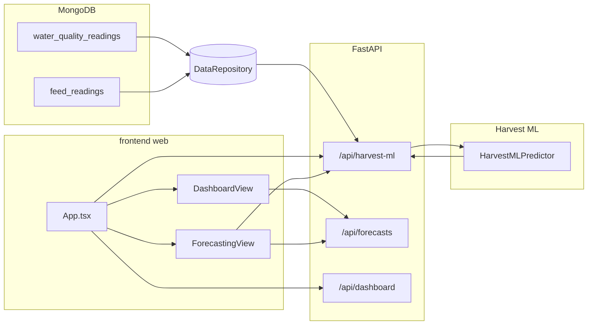

# Data flow: MongoDB → harvest prediction → dashboard

This document describes how pond data moves from MongoDB through the harvest ML stack to the web UI, and how that relates to other forecast content on the dashboard.

## High-level diagram

Harvest ML and the AI “forecast outlook” block are **separate**: the dashboard summary calls `/api/forecasts`; the XGBoost harvest table and trajectory live under `/api/harvest-ml` and are shown primarily on **Forecasting**, with the client prefetching harvest ML whenever dashboard data is loaded.

---

## 1. Database layer

### When MongoDB is used

- Set `USE_MONGODB=true` (and valid `MONGO_URI`) in the assistant’s environment.
- `DataRepository` connects to the configured database; if it cannot connect, `is_available` is false and harvest ML falls back to **agents** only (see below).

### Collections involved in harvest ML

| Collection | Role |
|------------|------|
| `water_quality_readings` | Latest row per pond → `WaterQualityData` (pH, DO, temperature, ammonia, salinity, …). |
| `feed_readings` | Latest row per pond → `FeedData` (shrimp count, average weight, feed amount, feeding frequency, …). Same collection is scanned for **historical** rows to build ML “extras”. |

### Repository methods

- **`get_latest_water_quality(pond_id)`** — Reads `water_quality_readings` for that pond, sorted by `timestamp` descending, limit 1. Returns `None` if empty or DB unavailable.
- **`get_latest_feed_data(pond_id)`** — Same pattern on `feed_readings`.
- **`get_harvest_ml_feed_extras(pond_ids)`** — Queries `feed_readings` over roughly the last **21 days** (configurable via `lookback_days`). For each pond it derives:
  - `weight_lag_7d` / `weight_lag_14d` — last known average weight on or before 7 / 14 days before the most recent sample day.
  - `rolling_feed_kg_7d` — sum of daily feed (kg) over the last 7 calendar days (`feed_amount * feeding_frequency / 1000` per day).
  - `days_normalized` — `min(1, number_of_distinct_days_with_weight / 120)` as a coarse “cycle progress” signal.

Pond IDs are matched flexibly (`pond_id`, `pond`, `pondId`, …) and with int/string/float variants for BSON compatibility.

---

## 2. API: `/api/harvest-ml`

Implemented in `api/server.py` as `get_harvest_ml`.

1. Loads a process-wide **`HarvestMLPredictor`** (singleton). If XGBoost/joblib models are missing under `HARVEST_ML_MODEL_DIR`, the response is `source: "unavailable"` and an empty `ponds` list with `detail` explaining the load error.
2. Builds `pond_ids = 1..ponds` from the `ponds` query parameter (aligned with dashboard pond count).
3. If MongoDB is enabled and the repository is available:
   - Calls **`get_harvest_ml_feed_extras(pond_ids)`** once for all ponds.
   - For **each** pond: tries **`get_latest_water_quality`** and **`get_latest_feed_data`**.
4. For each pond, if a latest row is missing, the API uses **`WaterQualityAgent`** / **`FeedPredictionAgent`** so inference still runs in dev or partial-data scenarios.
5. Merges optional extras into `predict_pond(...)` as `weight_lag_7d`, `weight_lag_14d`, `rolling_feed_kg_7d`, `days_normalized`.
6. Sets **`input_source`** on the response: `mongodb` (all ponds had DB water and feed), `mixed` (some from DB), or `agents` (no usable DB rows for those fetches).

Response shape matches the frontend types in `frontend/web/src/lib/types.ts` (`HarvestMlResponse`, per-pond `HarvestMlPondResult`).

---

## 3. Harvest prediction (`HarvestMLPredictor`)

File: `models/harvest_ml_predictor.py`.

- Builds a **14-feature vector** from `FeedData` + `WaterQualityData` (+ optional extras), in the order defined by `models/training/harvest_ml_features.py`.
- Runs four trained XGBoost models (days to harvest, harvest biomass, early-harvest risk, weight delta).
- Rolls the **weight delta** model forward day-by-day to produce **`growth_forecast`**.
- Derives calendar **`predicted_harvest_start` / `predicted_harvest_end`** from “now” + predicted days (fixed 10-day window after start).

Training artifacts are produced by `train_harvest_ml_models.py` and default to `models/harvest_ml/*.pkl`.

---

## 4. Frontend: loading and display

### Global fetch (`App.tsx`)

- **`useDashboardData`** loads **`/api/dashboard`** (main KPIs, tables, charts data).
- **`useHarvestMlData`** calls **`/api/harvest-ml`** when dashboard **`data`** exists (`enabled: Boolean(data)`), using `ponds: data.water_quality.length` (or fallback). The result is passed into **`ForecastingView`** as `harvestMl`.
- **Refresh** also triggers **`harvestMl.refresh()`** so harvest ML stays in sync after a manual reload.

### Dashboard page (`DashboardView.tsx`)

- The **“Forecast outlook”** panel uses **`useForecastsData`** → **`/api/forecasts`** (90-day AI forecast from `ForecastingAgent`). It is **not** the XGBoost harvest endpoint.
- **“Open full forecasting”** navigates to the Forecasting view where harvest ML UI lives.

### Forecasting page (`ForecastingView.tsx`)

- Still uses **`/api/forecasts`** for monthly-style AI charts where applicable.
- Renders **ML harvest (XGBoost)**: table (per pond), early-harvest alerts, ML growth trajectory chart when `harvestMl.data.source === 'xgboost'` and at least one pond is `available`.
- When ML is active, some headline numbers (harvest window string, forecasted weight, projected yield) can be overridden from the **first available** pond’s ML result for the filtered view.

---

## 5. Quick reference

| Step | Component | Output |
|------|-----------|--------|
| Persist readings | Orchestrator / IoT / saves | Documents in `water_quality_readings`, `feed_readings` |
| Read latest + history | `DataRepository` | `WaterQualityData`, `FeedData`, extras dict |
| Inference | `get_harvest_ml` + `HarvestMLPredictor` | JSON: days, biomass, risk, growth series, dates |
| Prefetch | `useHarvestMlData` in `App.tsx` | In-memory state for Forecasting |
| Summary forecast UI | `DashboardView` + `useForecastsData` | `/api/forecasts` only |
| Harvest ML UI | `ForecastingView` + `harvestMl` prop | `/api/harvest-ml` |

---

## 6. Operational notes

- Without trained models, `/api/harvest-ml` returns **`unavailable`**; the UI shows the training hint, not a crash.
- With **`USE_MONGODB=false`**, harvest ML still runs using **agent-simulated** water/feed and **without** Mongo-derived lags/rolling feed (predictor uses built-in defaults for missing extras).
- The dashboard **snapshot** (`/api/dashboard`) and **harvest ML** are independent requests; timestamps on each panel may differ slightly.
