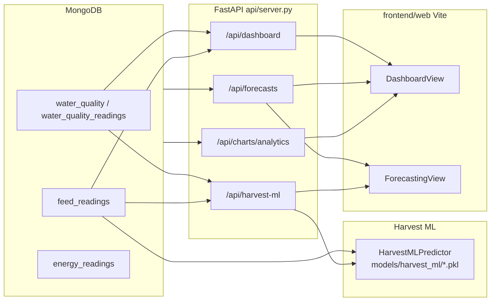

# Data flow: MongoDB → harvest prediction → dashboard UI

This document describes how farm data moves from storage (MongoDB), through the Python API, into **harvest ML** and **forecast** endpoints, and finally into the **frontend** (`frontend/web`). The same API patterns apply to the embedded app under `shrimp-farm-ai-assistant/web`.

---

## 1. Big picture

There are **three separate HTTP calls** the UI may make for “outlook” style information:

| Endpoint | Purpose | Shown in UI (typical) |
|----------|---------|------------------------|
| `GET /api/dashboard` | Live snapshot: water, feed, energy, labor, decisions, KPIs | Main **Dashboard** |
| `GET /api/forecasts` | 90-day style forecasts (rules or LLM via `ForecastingAgent`) | **Forecast outlook** panel on Dashboard + **Forecasting** page charts |
| `GET /api/harvest-ml` | XGBoost harvest timing, biomass, growth roll, early-harvest risk | **Forecasting** page (“ML harvest”) only |

For **`/api/dashboard`** and **`/api/forecasts`**, MongoDB is optional and agents can supply simulated pond data. **`/api/harvest-ml` does not use agent simulation**: it only runs when MongoDB is enabled, the repository connects, and each pond has **both** a latest water-quality row and a latest feed row (otherwise that pond is returned as `available: false` with a reason).

---

## 2. MongoDB → repository

`DataRepository` (`database/repository.py`) connects when `USE_MONGODB=true` and `MONGO_URI` is valid.

**Collections commonly used:**

- **`water_quality_readings`** / **`water_quality`** — latest or time-window readings (pH, DO, temperature, ammonia, etc.).
- **`feed_readings`** — per-pond feed amounts, frequencies, average weight over time.
- **`energy_readings`** — used for **analytics charts**, not directly inside the XGBoost harvest feature vector in the same way as feed/water.

**Helper behavior:**

- Queries tolerate mixed schema (`pond_id`, `pond`, `pondId`, …) and several timestamp field names so IoT/orchestrator documents still match.
- **`get_latest_water_quality(pond_id)`** / **`get_latest_feed_data(pond_id)`** — one “current” row per pond for inference.
- **`get_harvest_ml_feed_extras(pond_ids)`** — rolling features from **`feed_readings`** over a lookback window (e.g. weight lags, 7-day feed sum, normalized day index) merged into the ML feature vector per pond.
- **`get_analytics_charts_from_readings`** — aggregates for **Analytics & Trends** (used by `GET /api/charts/analytics` in the assistant app when wired to Mongo).

---

## 3. Harvest prediction (`GET /api/harvest-ml`)

**Entry:** `get_harvest_ml` in `api/server.py`.

**Steps:**

1. **Load models** — `HarvestMLPredictor` (`models/harvest_ml_predictor.py`) loads artifacts from `HARVEST_ML_MODEL_DIR` (default `models/harvest_ml/`), produced by `train_harvest_ml_models.py`. If files are missing, the endpoint returns `source: "unavailable"` and a `detail` message; the UI still renders an empty/unavailable state.

2. **Mongo gate** — If `USE_MONGODB` is false or the repository is not available, every pond gets `available: false` and a shared `detail` (no XGBoost call).

3. **Optional Mongo extras** — When the repository is available, **`get_harvest_ml_feed_extras`** runs once for all requested pond IDs (lags / rolling feed from **`feed_readings`**).

4. **Per pond (1 … N):**
   - Load **`get_latest_water_quality`** and **`get_latest_feed_data`**.
   - If **either** is missing → append `{ pond_id, available: false, detail }` (no agent fill-in).
   - If both exist → **`predictor.predict_pond(feed, wq, …)`** with `target_weight_g`, `horizon_days`, and any extras.

5. **Response metadata** — `input_source` is **`mongodb`** if at least one pond was predicted; **`n/a`** if none. Optional top-level **`detail`** when every pond was skipped.

6. **JSON** — `ponds[]` per pond: `available`, `days_to_harvest`, … when `available`; otherwise `detail` only.

---

## 4. Training data vs runtime (short)

- **Training:** Scripts under `models/training/` build a tabular dataset (e.g. CSV) and `train_harvest_ml_models.py` writes **`models/harvest_ml/*.pkl`** plus feature metadata.
- **Runtime:** Only the **pickled models** and **live inputs** are used; the API does not retrain on each request. Harvest ML inference uses **MongoDB readings only**; other endpoints may still use agents for simulation.

---

## 5. Frontend: how it reaches the browser

**Dev proxy:** `frontend/web/vite.config.ts` proxies `/api` → `http://127.0.0.1:8000` (uvicorn). The browser calls **relative** URLs such as `/api/dashboard`, so the API must be running locally (or you point the proxy at your deployed host).

**Hooks:**

- **`useDashboardData`** — fetches **`/api/dashboard`**; drives the main dashboard body.
- **`useForecastsData`** — fetches **`/api/forecasts?ponds=…&forecast_days=90`**; used by **DashboardView** (“Forecast outlook”) and **ForecastingView** (charts).
- **`useHarvestMlData`** — fetches **`/api/harvest-ml?ponds=…&target_weight_g=…&horizon_days=…`**; in `App.tsx` the bundle is passed into **ForecastingView** as `harvestMl`. **Refresh** in the top bar also triggers `harvestMl.refresh()` so ML results update with the rest.

**Where things appear:**

- **Dashboard** — KPIs, pond cards, analytics (and in the assistant fork, Mongo-backed analytics when enabled). **Forecast outlook** = summary from **`/api/forecasts`**, not from harvest-ml.
- **Forecasting** — Full charts from **`/api/forecasts`** plus the **ML harvest (XGBoost)** panel from **`/api/harvest-ml`**.

---

## 6. Configuration checklist

| Setting | Effect |
|---------|--------|
| `USE_MONGODB` | Enables `DataRepository` for latest readings and harvest extras |
| `MONGO_URI` | Connection string |
| `HARVEST_ML_MODEL_DIR` | Override path to trained `.pkl` files |
| `DASHBOARD_CACHE_TTL_S` | In-memory cache TTL for `/api/dashboard` (0 = always recompute) |
| `DECISION_RECO_ENABLE_LLM` | LLM on/off for long recommendation text on dashboard |

---

## 7. Failure modes (what users see)

- **Forecasts HTTP error** — Dashboard “Forecast outlook” shows the error line; Forecasting charts still use **calculated fallbacks** from live dashboard numbers where implemented.
- **Harvest ML unavailable** — `source: unavailable` when models are missing; or `source: xgboost` with all ponds `available: false` when Mongo is off, DB is down, or a pond lacks latest water **and** feed rows (see per-pond `detail`). No agent backfill.

---

## 8. File map (quick reference)

| Layer | Files |
|-------|--------|
| API | `api/server.py` (`get_dashboard`, `get_forecasts`, `get_harvest-ml`, `get_charts_analytics`) |
| DB access | `database/repository.py` |
| Predictor | `models/harvest_ml_predictor.py` |
| Training | `train_harvest_ml_models.py`, `models/training/*` |
| Config | `config.py` |
| UI data | `frontend/web/src/lib/useDashboardData.ts`, `useForecastsData.ts`, `useHarvestMlData.ts` |
| UI views | `frontend/web/src/components/DashboardView.tsx`, `ForecastingView.tsx`, `App.tsx` |

This should be enough to trace **one row in `feed_readings`** from Mongo through **`get_harvest_ml_feed_extras` + latest feed/water** into **`predict_pond`**, then into **`ForecastingView`** as a table row and optional growth chart.
